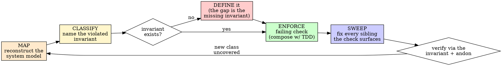

# Big-Picture-Driven Development (BPDD)

## Overview

Model the system before you touch the fix. Name the invariant the defect
violates. Enforce it. Sweep every sibling.

**Core principle:** A reported defect is a *sample* of a class. If you fix the
sample and not the class, the class will report the next sample — through a
human's eyes. That is fingerpointing, and it is the failure this skill exists
to kill.

**Violating the letter of the rules is violating the spirit of the rules.**

## The Iron Law

```
NO INSTANCE FIX WITHOUT FIRST NAMING THE INVARIANT IT VIOLATES
— AND SWEEPING FOR ITS SIBLINGS.
```

If you cannot name the invariant, **the missing invariant is the bug.** Define
it before you patch anything.

Caught yourself thinking "this one's obviously a one-off, I'll just fix it"?
Stop. That is the rationalization. Most "one-offs" are an un-named invariant
with hidden siblings.

## When to Use

**Always, before fixing:**
- Any defect or gap a human REPORTED (the human is the symptom of a missing check).
- A "is this complete / what are we missing?" review.
- A recurring bug ("this keeps happening") — recurrence IS the class signal.
- A cross-cutting consistency question (the same value/claim in many places).

**Exceptions (ask your human partner):**
- A genuinely isolated text typo with provably no class and no siblings.
- A throwaway prototype.

## The Loop: MAP → CLASSIFY → ENFORCE → SWEEP



### MAP — reconstruct the system model first
Before reading the buggy line, draw the slice of the big picture the defect
lives in. For this repo that is usually one of: the **claim → evidence →
render** graph (a dashboard number must trace to a contract field that a panel
shows), or the **value-stream / wires** (a service must deliver its contract to
the next; see [[andon-loop]]). Use `serena` to find the symbols and their
referencing sites — the map is *who computes this and who consumes it*, not the
single failing call. Output of MAP: "where does this defect sit, and what does
it touch?"

### CLASSIFY — name the invariant
State the rule the defect breaks as a sentence that applies to a *whole class*,
not this instance. "Gauss1 doesn't render" is an instance. "**Any audited claim
must have visible evidence**" is the invariant. If no such rule exists in
`references/invariant-classes.md` or the contract, you have found the real
defect: an un-named invariant. Name it and add it.

### ENFORCE — make divergence impossible, then caught
Encode the invariant as a check that fails on this instance AND every sibling.
Prefer, in order: (1) **structural** — derive the claim FROM the evidence so
they cannot diverge by construction; (2) **contract validator** — a model that
refuses to serialize in an inconsistent state; (3) **test/gate** — the
generalized invariant suite. This step *composes with*
`superpowers:test-driven-development`: the invariant IS the failing test —
watch it fail on the reported instance before you fix anything.

### SWEEP — fix the class, not the sample
Run the new check across the whole system. It will surface siblings the human
never reported. Fix them in **this** pass. A SWEEP that finds zero siblings is
suspicious — re-read the MAP; the invariant is probably too narrow.

Verify via the invariant and the [[andon-loop]] (halt on any red wire), never
by eye. "Looks fixed" is how the sample got fixed and the class survived.

## Red Flags

| Thought | Reality |
|---|---|
| "Just a one-line fix" | Name the invariant first. The line is a sample. |
| "Obvious one-off" | Most one-offs are an un-named invariant with hidden siblings. |
| "The user pointed at it, just fix *that*" | The pointer reveals a **class**. Fix the class. |
| "Modeling is overkill here" | One MAP is cheaper than the next three bug reports. |
| "I'll add the invariant later" | Later = the next fingerpoint. |
| "SWEEP found nothing, done" | Re-check the invariant scope — it's probably too narrow. |
| "Tests pass, so the class is closed" | Did a NEW test pin the invariant, or did old tests just stay green? |

## Anchors

**CLAUDE.md sections** (read before acting):
- *Code Conventions (pydantic-first)* — declare-don't-loop, registry-over-map:
  the same instinct as invariant-over-instance. An invariant is a declarative
  contract, not a per-case patch.
- *Tooling: use MCP servers for discovery* — MAP is a serena/symbol task first.

**Hooks**: `suggest-discovery-enrichment.sh` (PostToolUse/Grep, non-blocking) fires after
a bug/issue-pattern grep and suggests the GitHub + context7 + WebSearch enrichment trio.
The invariants this discipline produces also become hooks/validators/tests that DO fire
(the deeper goal).

## Serena first

`serena_first: true`. MAP begins with `mcp__serena__find_symbol` /
`get_symbols_overview` / `find_referencing_symbols` to reconstruct who computes
and who consumes the thing under defect — never a single-file read of the
failing line.

## Discovery enrichment

After serena maps *who computes and who consumes*, extend the MAP and ENFORCE phases with
upstream and API discovery. Phase-gated table:

| Phase | Tool | Call | Purpose |
|-------|------|------|---------|
| MAP | GitHub | `mcp__github__search_issues` | Has this invariant class been reported upstream? |
| MAP | GitHub | `mcp__github__search_code` | Are there instances outside this repo? |
| MAP | GitHub | `mcp__github__get_file_contents` | Read upstream implementation for comparison |
| CLASSIFY | GitHub | `mcp__github__search_issues` | Does this invariant already have a name in an issue? |
| ENFORCE | context7 | `npx ctx7@latest docs <id> "<query>"` | Confirm current library API before encoding the check |
| ENFORCE / SWEEP | WebSearch | `WebSearch` / `WebFetch` | Broader context: error messages, algorithm variants, cross-project patterns |

These are enrichment steps, not substitutions. Serena always runs first; these extend
the MAP/ENFORCE reach. The `suggest-discovery-enrichment.sh` hook fires PostToolUse on
Grep (bug/issue patterns only) to prompt this enrichment automatically.

## Decision: which sub-document?

| Subject | Reference |
|---------|-----------|
| The catalog of invariant classes to CLASSIFY against (claim⇒evidence, single-derivation, cross-panel consistency, enumeration completeness, no-empty-when-claimed, value-stream wire) + the NIST worked example | `references/invariant-classes.md` |

## Composes with

1. `superpowers:test-driven-development` — ENFORCE writes the failing test; the
   invariant is what the test pins.
2. `verification` — an enforced invariant is a V&V wire; the RIGOR pillar.
3. `andon-loop` — SWEEP across streams + halt-on-red; tri-stream hosts the sweep.
4. `superpowers:brainstorming` — MAP grounds the design when the invariant set
   isn't yet defined.
5. `superpowers:verification-before-completion` — never claim "fixed" without an
   invariant reading.

## Three-pillar reporting

On a cycle close that applied BPDD, record one line under RIGOR:

> `RIGOR (BPDD): invariant <name> enforced as <structural|validator|test>; SWEEP fixed N/M siblings; 0 unfixed.`

PERF: the invariant must not bloat the hot path (a check, not a per-call cost).
PRESENTATION: a newly-enforced invariant that changes a rendered claim must be
disclosed (e.g. in `LIMITATIONS.md`), never silently flipped.
