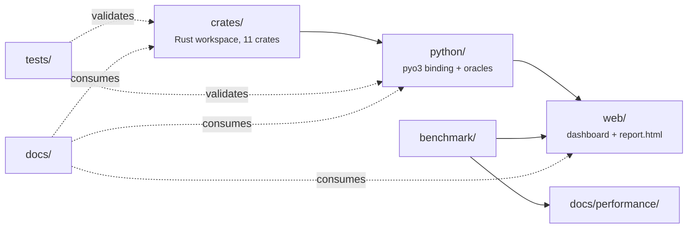
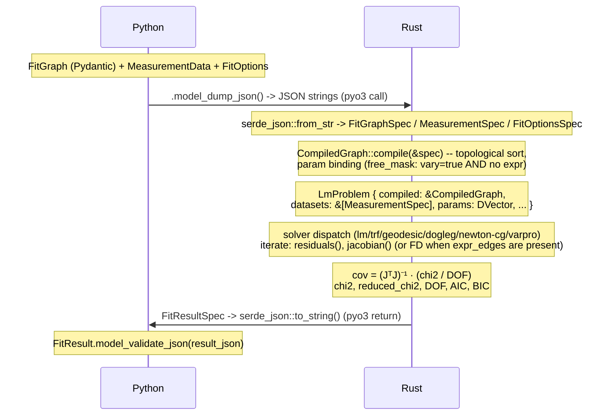
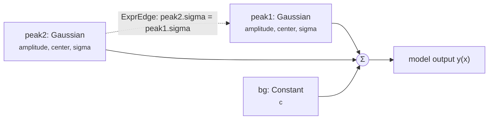

# ARCHITECTURE — spectrafit-core

## Overview

spectrafit-core is a high-performance numerical fitting framework. The computation
kernel is written in Rust and exposed to Python via pyo3/maturin. The Python
layer provides Pydantic schemas, a DAG composition interface, and an HTML
dashboard for result visualisation.

## Goals

1. Replace lmfit's runtime Python dispatch with compiled Rust model kernels.
2. Replace binary-tree operator-overloaded composition with an explicit DAG IR.
3. Replace per-iteration `asteval` expression evaluation with pre-compiled
   expression trees evaluated in Rust.
4. Provide **analytical Jacobians** for built-in model types where possible
   (most do; a handful still fall back to finite differences — see the
   `Model::jacobian` note below).
5. Support global fits with correct DOF via rayon parallel residual evaluation.

---

## Stack

| Layer             | Technology                              |
|-------------------|-----------------------------------------|
| Kernel language   | Rust 2021 edition                       |
| Solver family     | LM / TRF / geodesic (levenberg-marquardt crate + faer-native trust-region core), dogleg, Newton-CG, VarPro |
| Linear algebra    | nalgebra + faer                         |
| Parallelism       | rayon                                   |
| Python binding    | pyo3 + maturin                          |
| Python schemas    | Pydantic v2                             |
| Python version    | >=3.13                                  |
| Package manager   | uv                                      |
| Offline HTML report | `uv run poe report_html` — bundles `results.json` via the `web/` Vite+React app (`npm run build:html`); no matplotlib/Jinja2 involved |

---

## Directory Layout

A high-level build/data-flow view — the crate-level dependency DAG lives in
[Rust crate overview](../reference/rust/overview.md#dependency-graph) and
isn't duplicated here.



The listing below is generated by `rrt tree` and then filtered by
[`scripts/render_architecture_tree.py`](https://github.com/Anselmoo/SpectraFit-Core/blob/main/scripts/render_architecture_tree.py)
to drop `analysis/`, `test-results/`, and `vibe-sessions/` — working-artifact
directories that either aren't published to this repo's GitHub mirror at all
(`analysis/`, per `pyproject.toml`'s
`[tool.rrt.publish_targets.github].exclude`) or are empty scratch dirs with
no architectural content. A raw, unfiltered dump would be technically
accurate on GitLab but actively misleading here, since the GitHub mirror
doesn't have `analysis/` on disk at all. Refresh after a structural change
with:

```bash
rrt tree --root . --max-depth 2 --snapshot
uv run python scripts/render_architecture_tree.py
```

`rrt tree --root . --max-depth 2 --check` still detects drift against the
real repo structure (enforced in CI, see `ci.yml`'s `lint` job) — it
compares against the full, unfiltered snapshot in `.rrt/tree.lock.toml`,
independent of this page's filtering.

**Do not hand-edit the block between the markers below** — it will be
silently overwritten on the next refresh.

<!-- rrt:auto:start:dirtree -->
```text
|-- benchmark/
|   `-- scenarios/
|-- crates/
|   |-- spectrafit-builder/
|   |-- spectrafit-core/
|   |-- spectrafit-dogleg/
|   |-- spectrafit-graph/
|   |-- spectrafit-levenberg-marquardt/
|   |-- spectrafit-models/
|   |-- spectrafit-newton-cg/
|   |-- spectrafit-solver/
|   |-- spectrafit-trust-region/
|   |-- spectrafit-types/
|   |-- spectrafit-varpro/
|   `-- README.md
|-- docs/
|   |-- contributor-guide/
|   |-- explanation/
|   |-- fonts/
|   |-- getting-started/
|   |-- how-to/
|   |-- images/
|   |-- javascripts/
|   |-- reference/
|   |-- release-notes/
|   |-- stylesheets/
|   |-- tutorials/
|   |-- _render_benchmark_summary.py
|   |-- glossary.md
|   |-- index.md
|   |-- limitations.md
|   |-- security.md
|   `-- why-spectrafit-core.md
|-- overrides/
|   |-- partials/
|   |-- 404.html
|   |-- home.html
|   |-- main.html
|   `-- section-index.html
|-- python/
|   |-- oracles/
|   `-- spectrafit_core/
|-- scripts/
|   |-- audit/
|   |-- audit_bindings.py
|   |-- audit_latex.py
|   |-- backport_from_github.py
|   |-- bg.sh
|   |-- binding_audit_notes.toml
|   |-- check_crate_conventions.py
|   |-- check_pytest_bg.sh
|   |-- check_stale_github_branches.py
|   |-- coverage_atlas.py
|   |-- fast_lane_gate.py
|   |-- mcp_spectrafit_reports.py
|   |-- publish_exclusions.py
|   |-- publish_remove_excluded.py
|   |-- publish_snapshot.sh
|   |-- purge_github_actions_runs.py
|   |-- render_architecture_tree.py
|   |-- run_pytest_bg.sh
|   |-- self_heal_automation.py
|   `-- shellcheck_ci.py
|-- tests/
|   |-- audit/
|   |-- inference/
|   |-- integration/
|   |-- meta/
|   |-- parity/
|   |-- scenario/
|   |-- unit/
|   `-- conftest.py
|-- web/
|   |-- public/
|   |-- scripts/
|   |-- src/
|   |-- tests/
|   |-- index.html
|   |-- openapi.snapshot.json
|   |-- package-lock.json
|   |-- package.json
|   |-- playwright.config.ts
|   |-- README.md
|   |-- tsconfig.json
|   |-- vite.config.ts
|   `-- vitest.config.ts
|-- ARCHITECTURE.md
|-- Cargo.lock
|-- Cargo.toml
|-- CHANGELOG.md
|-- CITATION.cff
|-- CLAUDE.md
|-- CODE_OF_CONDUCT.md
|-- CONTRIBUTING.md
|-- DECISIONS.md
|-- LICENSE
|-- LIMITATIONS.md
|-- MODELS.md
|-- package-lock.json
|-- package.json
|-- pyproject.toml
|-- README.md
|-- SECURITY.md
|-- tsconfig.json
|-- uv.lock
`-- zensical.toml
```
<!-- rrt:auto:end:dirtree -->

---

## Data Flow



---

## Model Composition — DAG IR

Models are defined as a directed acyclic graph at the Python level, serialised
to JSON, and evaluated entirely in Rust. Concretely — two peaks tied to a
shared width, summed with a background:



### Nodes

Each node is a `ModelNodeSpec`: a typed model instance with named parameters.

```python
class ModelNodeSpec(BaseModel):
    id: str                               # unique within graph
    model_type: ModelType                 # Gaussian | Lorentzian | ...
    parameters: dict[str, Parameter]
    dataset_index: int | None = None      # None = global node; multi-dataset scoping
```

### Edges

Edges encode parameter constraints (ties) across nodes, and **are evaluated in
Rust** — `expr_edges` are parsed into an `Expr`/`TiedPlan` AST
(`spectrafit-graph::expr`) at compile time, then re-applied every solver
iteration by `spectrafit-solver::problem::set_free_and_tied` (shared by both
the nalgebra-LM and faer trust-region front-ends) so each tied target is
recomputed from its expression before the model is evaluated:

```python
class ExprEdge(BaseModel):
    target_node: str
    target_param: str
    expression: str    # e.g. "0.5 * peak1.amplitude"
```

### Aggregation

Default: **sum** of all node outputs at each x point.

### Why not operator overloading (lmfit-style)?

lmfit's `model1 + model2` creates a binary tree evaluated recursively at
Python speed, allocating N temporary NumPy arrays per iteration. Our DAG is
compiled once to a Rust struct; evaluation is a single O(N_nodes * N_x) loop
with no Python round-trips.

---

## Parameter Model

```python
class Parameter(BaseModel):
    value: float                # initial value
    min: float = -inf
    max: float = inf
    vary: bool = True           # False → fixed constant; ignored when expr is set
    expr: str | None = None     # constraint expression; evaluated every solver iteration
    scale: float | None = None  # solver step-size hint; None → |value| or 1.0
```

`name` is the dict key in `ModelNodeSpec.parameters` — not duplicated as a field.

`vary` is **ignored** whenever `expr` is set — the engine always derives the
value from the expression and excludes the parameter from the free set
regardless of `vary`'s value. There is no validator requiring `vary=True`
when `expr` is set; `vary` simply has no effect in that case.

Three binding kinds resolved at compile time (`free_mask = vary AND expr is
None`, `spectrafit-graph::compiler`):

| Kind    | vary  | expr | Behaviour                                    |
|---------|-------|------|-----------------------------------------------|
| Free    | True  | None | Element of the optimisation vector           |
| Fixed   | False | None | Constant; never updated                      |
| Expr    | any   | set  | Derived from expression every iteration (Rust `TiedPlan`) — `vary` is ignored |

Bounds (min, max) are enforced by reflective projection, not clamping: a step
that overshoots a bound is mirrored back into range (`p < lo` → `2*lo - p`,
and symmetrically at `hi`), with an extreme overshoot parked at the violated
bound instead of reflecting past the opposite one. This runs in
`LmProblem::apply_free_params` (`crates/spectrafit-solver/src/problem.rs`),
called from both solver front-ends' `set_params`, not inside `residuals()`.
`scale` is applied as an internal change-of-variables preconditioning: the
solver works on `theta' = theta / scale` (`LmProblem::scales`,
`apply_free_params`/`scale_columns_rowmajor` in
`crates/spectrafit-solver/src/problem.rs`), not forwarded to any external
`x_scale` field — the `levenberg-marquardt` crate this workspace vendors has
no such field.

---

## Rust Model Kernels

```rust
pub trait Model: Send + Sync {
    /// x is a coordinate slice: len=1 for 1-D models, len>=n_dims() for nD models.
    fn eval(&self, x: &[f64], params: &[f64]) -> f64;
    /// Default: forward-difference finite differences. Most built-in kernels
    /// override with an analytical formula; six currently don't (asym_ir,
    /// breit_wigner, harmonic_ir, moffat, students_t, split_pearson7 — each
    /// overrides with a hand-written central-difference FD loop instead,
    /// tracked as a follow-up to give them analytical Jacobians too).
    fn jacobian(&self, x: &[f64], params: &[f64]) -> Vec<f64> { /* FD fallback */ }
    /// Owned Vec<Cow<'static, str>> — not a static slice, so runtime-generated
    /// models (e.g. GaussianND{d}'s indexed center_0..center_{d-1}) can name
    /// their own params without a compile-time-static list.
    fn param_names(&self) -> Vec<std::borrow::Cow<'static, str>>;
    fn n_dims(&self) -> usize { 1 }  // override for nD models
}
```

### Built-in models

The catalog has grown well past an initial handful — 34 wire variants as of
this writing. See the [Model Reference](../reference/models/index.md) for
the full, authoritative formula table (canonical parameter names, real
LaTeX formulas, one row per model, kept in sync with the Rust kernels and
the Python parity oracles by convention) — **not duplicated here**: an
earlier hand-copied subset of that table lived on this page, in plain-text
notation, and had already drifted (still `A * exp(...)` after the model
reference itself moved to real LaTeX). One table, one place, linked from
here instead.

Every model's mixing/weight parameter is named for what it *is* — e.g. the
pseudo-Voigt Lorentzian fraction is always `fraction`, never `eta`/`frac`
(see the [Model Reference](../reference/models/index.md)'s naming-history
section).

---

## DAG Graph Engine (Rust)

```rust
struct CompiledGraph {
    nodes:          Vec<NodeEntry>,
    free_keys:      Vec<String>,               // "node_id.param_name", sorted
    node_free_cols: Vec<Vec<(usize, usize)>>,  // per-node (local_param_idx, jac_col)
    tied_plan:      TiedPlan,                  // dependency-ordered expr_edge plan
    dataset_offsets: Vec<usize>,                // per-dataset point boundaries (global fits)
}

struct NodeEntry {
    id:            String,
    model:         Box<dyn Model>,
    param_names:   Vec<String>,
    free_mask:     Vec<bool>,           // vary=true AND no expr, per param
    dataset_index: Option<usize>,       // None = global node; Some(i) = dataset-local
}
```

(`ParamBinding`/`CompiledNode` names some earlier drafts of this document used
do not exist in the current compiler — see `crates/spectrafit-graph/src/compiler.rs`.)

### evaluate(&graph, x_vals, free_params)

```
output[i] = 0.0
for each node n in compiled.nodes:
    p = resolve params via n.free_mask / n.param_names
    for each i, coord in x_vals:               // coord = &x_vals[i]  (len D)
        output[i] += n.model.eval(coord, &p)
```

### jacobian(&graph, x_vals, free_params)

```
jac[i][j] = 0.0
for each node n in compiled.nodes:
    p = resolve params
    node_jac = n.model.jacobian(&x_vals[i], &p)  // analytical (or FD fallback), coord slice
    for each (local_idx, jac_col) in node_free_cols[node_idx]:
        jac[i][jac_col] += node_jac[local_idx]
```

When `tied_plan` is non-empty, ties are re-applied before each evaluation and
the analytical Jacobian is swapped for a finite-difference one so the
tied-parameter chain-rule terms are captured correctly.

---

## Solver

`spectrafit-solver::problem::LmProblem<'a>` implements
`LeastSquaresProblem<f64, Dyn, Dyn>` from the `levenberg-marquardt` crate. It
borrows (does not own) `&'a CompiledGraph` and `&'a [MeasurementSpec]`, plus
per-iteration scratch state (`node_param_bufs`, `free_to_node_param`,
cached `x_concat`/`y_concat`). This is one of several strategy front-ends
`spectrafit-solver` dispatches to (`lm`/`lm-legacy`/`trf`/`irls`/`global`
(differential evolution)/`varpro`/`geodesic`) — LM is the default.

Residual:   `r_i = (y_i - f(x_i)) / sigma_i`
Jacobian:   `dr_i/dp_j = -(df/dp_j) / sigma_i`

### Post-fit statistics

The *reported* `chi2` below is a fresh unweighted sum-of-squares — distinct
from the weighted residual `r_i` the solver itself minimizes above — kept
comparable across backends regardless of how each one weights internally.
AIC/BIC are derived from a proper Gaussian-deviance term, not raw `chi2`
directly (an earlier "raw chi2 as deviance" form put spectrafit on a
different scale than the lmfit/jax oracles and was deliberately replaced).
Covariance has two paths depending on whether per-point `sigma` was supplied.

```
chi2          = sum((y_i - f(x_i))^2)                 # unweighted, NOT sum(r_i^2)
DOF           = N_points - N_free
reduced_chi2  = chi2 / DOF
neg2_log_l    = N_points * ln(chi2 / N_points)         # Gaussian deviance term
AIC           = neg2_log_l + 2 * N_free
BIC           = neg2_log_l + N_free * ln(N_points)
r_squared     = 1 - chi2 / sum((y_i - y_mean)^2)

cov (sigma provided)     = (J_w^T J_w)^{-1}            # J_w[i,:] = J[i,:] / sigma_i
cov (no sigma supplied)  = (J^T J)^{-1} * (chi2 / DOF) # scale-from-residuals estimate
stderr[j]     = sqrt(cov[j,j])
```

For multi-dataset global fits: `DOF = sum_d(N_d) - N_free_shared`.

See **Multi-Dataset & Multi-Dimensional Fitting** below.

---

## Standalone Evaluation (No Fitting)

The framework is usable without the solver — a first-class path in both
Python and Rust.

### Python

```python
# Evaluate compiled graph at given parameters, no fitting
y_model: np.ndarray = graph.eval(params, data)

# Per-node component outputs
components: dict[str, np.ndarray] = graph.eval_components(params, data)
```

`FitGraph.eval()` serialises graph + params + data to JSON, calls the Rust
`evaluate` pyfunction, and returns a numpy array. No LM solver is invoked.

### Rust public API

The Python-independent, typed API lives in `spectrafit-graph/src/lib.rs` —
`pub fn` taking real Rust values (not JSON strings), usable as an `rlib`
dependency without pyo3:

```rust
pub fn evaluate(
    graph: &FitGraphSpec,
    params_flat: &HashMap<String, f64>,
    x: &[f64],
) -> Result<Vec<f64>, CoreError>;

pub fn evaluate_components(
    graph: &FitGraphSpec,
    params_flat: &HashMap<String, f64>,
    x: &[f64],
) -> Result<HashMap<String, Vec<f64>>, CoreError>;

pub fn jacobian(
    graph: &FitGraphSpec,
    params_flat: &HashMap<String, f64>,
    x: &[f64],
) -> Result<DMatrix<f64>, CoreError>;
```

Separately, `crates/spectrafit-core/src/lib.rs` (the pyo3 `cdylib`) has its
own **private**, JSON-string-based `evaluate`/`evaluate_components` functions
decorated `#[pyfunction]` — these wrap the typed API above for the Python FFI
boundary and are not themselves `pub`/rlib-consumable.

---

## Multi-Dataset & Multi-Dimensional Fitting

### Multi-dimensional independent variables

The `Model` trait accepts `x: &[f64]` — a coordinate slice of length `D`.
For standard 1-D models `D = 1`; callers pass `&[x_i]`. nD models override
`n_dims()` and expect e.g. `&[x_i, t_i]` for a 2-D energy/temperature surface.

On the Python side `MeasurementData.x` is a numpy array of shape `(N,)` for
1-D or `(N, D)` for nD. Serialised to JSON as a flat `list[list[float]]`
(each inner list is one coordinate vector); 1-D is `[[x0], [x1], ...]`.

```python
class MeasurementData(BaseModel):
    x: list[list[float]]        # shape (N, D); D=1 for 1-D data
    y: list[float]              # shape (N,)
    sigma: list[float] | None   # shape (N,) or None → uniform weight
    label: str | None = None    # optional dataset identifier
```

### Multi-dataset global fitting

`fit()` accepts a single dataset or a list of datasets. All datasets share the
same `FitGraph` (and therefore the same free parameters). Residuals from all
datasets are concatenated before the LM solver sees them.

```python
# single dataset
result = fit(graph, data, options)

# global fit over multiple datasets
result = fit(graph, [data_A, data_B, data_C], options)
```

On the Rust side `LmProblem` borrows `&[MeasurementSpec]` (concatenated into
`x_concat`/`y_concat` once at construction). Rayon parallelism
(`spectrafit-graph::executor`) is **point-wise**, not a per-dataset split — a
size-based auto-switch between sequential and `par_iter_mut`/`par_chunks_exact`
inside `evaluate_compiled_indexed` and the residual/Jacobian kernels, keyed off
`rayon::current_num_threads()` and problem size:

```
evaluate_compiled_indexed(compiled, node_param_bufs, x_concat, out):
    if x_concat.len() is large enough (rayon::current_num_threads()-aware):
        out.par_iter_mut().zip(x_concat.par_chunks_exact(stride)) ...      // rayon
    else:
        out.iter_mut().zip(x_concat.chunks_exact(stride)) ...              // sequential

DOF = sum_d(N_d) - N_free_shared
```

The `FitResult` is the same schema regardless of whether one or many datasets
were used; `best_fit` and `residuals` are the concatenated arrays in dataset
order.

---

## FitResult

```python
class ParameterResult(BaseModel):
    name: str
    value: float
    min: float
    max: float
    vary: bool
    expr: str | None
    stderr: float | None        # None if fit did not converge

class DatasetSlice(BaseModel):
    label: str | None           # from MeasurementData.label
    n_points: int
    best_fit: list[float]       # model output for this dataset
    residuals: list[float]      # (y - f) / sigma for this dataset
    chi2: float                 # partial chi2 contribution

class FitResult(BaseModel):
    schema_version: str = "0.1"
    parameters: dict[str, ParameterResult]
    covariance: list[list[float | None]] | None
    chi2: float
    reduced_chi2: float
    r_squared: float
    dof: int
    aic: float
    bic: float
    n_iter: int
    n_func_evals: int | None    # None if unavailable
    n_jac_evals: int | None     # None if unavailable
    success: bool
    message: str
    best_fit: list[float]       # concatenated across all datasets
    residuals: list[float]      # concatenated across all datasets
    init_fit: list[float]       # model at initial parameter values
    components: dict[str, list[float]]   # node_id → best_fit per DAG node
    dataset_slices: list[DatasetSlice] | None  # None for single-dataset
    condition_number: float | None       # cond(J^T J) at the solution
    n_de_generations: int | None         # differential-evolution generations, if used
    cost_history: list[float]            # per-iteration cost ½‖r‖² trajectory
    gradient_norm_history: list[float]   # per-iteration ‖J^T r‖_∞
    params_history: list[list[float]]    # per-iteration parameter vector
    covariance_param_order: list[str] | None  # free-param names indexing `covariance`
```

---

## Python / Rust Boundary

All data crosses the boundary as **JSON strings**:

- Python → Rust:  `pydantic_obj.model_dump_json()` passed as `&str` via pyo3
- Rust → Python:  `serde_json::to_string(&result)` returned as `String`

This keeps the pyo3 FFI layer trivial (no custom type conversions) and makes
the boundary independently testable with plain string I/O.

Future: replace JSON with MessagePack for large-dataset performance.

---

## Versioning

`FitGraph`/`GlobalFitGraph`/`FitResult`/`ExprEdge` carry
`schema_version: str = "0.1"`. Breaking schema changes bump the minor version.
Unknown fields **raise a validation error** (`ConfigDict(extra="forbid")`) —
not silently ignored.

---

## Out of Scope

| Feature                         | Notes                                   |
|---------------------------------|-----------------------------------------|
| Confidence interval profiling   | Needs profile-likelihood / MCMC         |
| Plugin / custom model registry  | Needs safe Rust FFI plugin loader       |
| Full covariance matrix input    | Requires Cholesky weight transform      |
| Energy-axis unit metadata       | Orthogonal to fitting logic             |

(`ExprEdge` Rust evaluation and the benchmark/verification engine — both
formerly listed here as out of scope — are implemented; see "Edges" above and
"Benchmark Engine + Report" below.)

---

## Benchmark Engine + Report (`python/oracles`)

The benchmark/verification suite is **registry-driven and pydantic-first**, emitting a
frozen JSON contract consumed by a Vite + React UI. There is no Jinja2/HTML artifact — one
data flow: **benchmark run → results.json → FastAPI → React**.

### Module structure

```
python/oracles/           # was python/benchmark/, then python/extras/bench/ — merged F13
├── cases.py       # CategoryDef registry + CaseSpec/CaseFamily + build_catalog/materialize
├── models.py      # MODEL_REGISTRY — numpy formulas (the parity oracle for the Rust kernels)
├── backends/      # spectrafit (the SUBJECT) + lmfit, jax/optimistix (cross-check oracles)
├── engine.py      # build_report: run_suite (all 139) + run_featured (deep-dive every case);
│                  #   re-imports _multidim/_global_fit from _engine_multidim (see below)
├── _engine_base.py, _engine_multidim.py, _engine_nested.py, _engine_profile.py
│                  #   engine.py facade split (G27) — _engine_multidim.py's _multidim() fits
│                  #   a genuine ≥3-D gaussian_nd recovery (real subject, not a 2-D map);
│                  #   _global_fit() runs a GlobalFitGraph shared-model multi-spectrum joint fit
├── metrics.py     # timing / accuracy / ECDF / spread / pull statistics
├── synth.py       # deterministic synthetic BenchReport (test fixture; never served)
├── bench_contract.py  # the FROZEN BenchReport contract (Pydantic) — single source of truth
├── contract.py    # small shared-leaf module (SolverMeta, _Contract base) — NOT the BenchReport home
├── api.py         # FastAPI: GET /api/report (latest), /api/runs, /api/report/{run_id}
├── reports.py     # run-centric output: .spectrafit_reports/<category>/<date>_run_NNN/
└── cli.py         # `run` (write results.json + manifest.json) · `gate` (regression gate)
```

### Contract → UI

`bench_contract.py` (not `contract.py` — that's a small shared-leaf module) defines the
frozen `BenchReport` contract and is the single source of truth. The FastAPI app publishes
its OpenAPI schema from it; `web/src/openapi.gen.ts` is generated from that live schema
(`npm run contract`) and `web/src/contract/index.ts` re-exports the view types — so the React
views never drift from the Python models. The web app (`web/`, Vite + React) fetches
`/api/report` at boot and renders **2 destinations** — **Standing** (`#standing`, default:
facts masthead + per-backend results table) and **Evidence** (`#evidence`: all cases side
by side, including the N-D and global-fit "Native showcases" section; `#audit` redirects
here) — with no silent fallback and no hardcoded backend ids (enforced by a vitest
source-scan test). A `vitest` suite (`web/src/__tests__/*`) renders every panel from
fixtures without a browser.

### Run & gate

`uv run poe benchmark` writes `results.json` + `manifest.json` into a fresh run dir;
`uv run poe serve` serves the latest over FastAPI; `python -m oracles.cli gate` fails if
the geomean speedup vs the pinned `baseline_solver_id` (default `lmfit`) drops below 1× or
max |Δr²| (LM-family cases) exceeds 1e-3. The test suite (`tests/unit/benchmark/`,
`tests/audit/`) proves the JSON is real (every category deep-dived, analyzed set multiple +
unique, per-case plots distinct, all-finite) before the UI consumes it.

!!! note
    Adding a model/case is a multi-crate change — see
    [Adding a model](../how-to/adding-a-model.md) for the Rust kernel + `ModelTypeStr`
    wiring, then [Adding a new benchmark model](benchmark-engine.md#adding-a-new-benchmark-model)
    for the benchmark-registry step.
