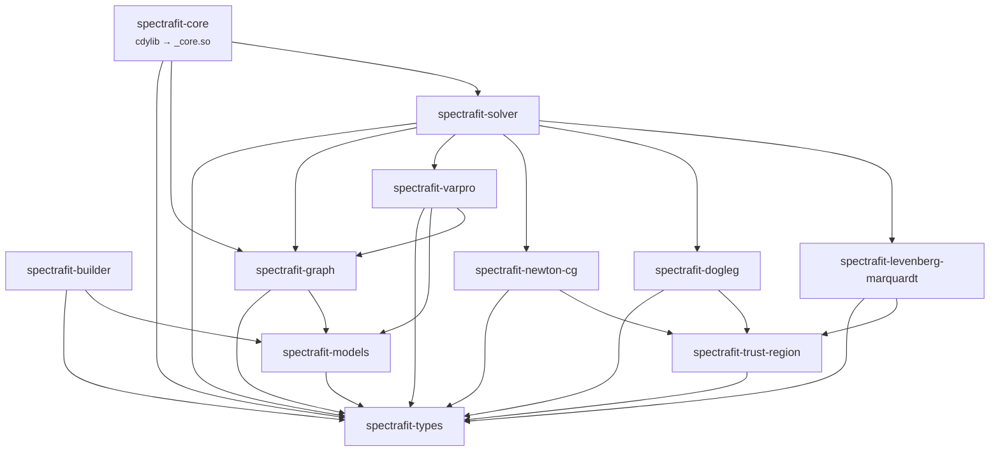

# Rust workspace overview

The spectrafit-core Rust workspace is organized into 11 composable crates with a
strict downward dependency hierarchy. This page is the entry point to all of
them: the table records what each crate is responsible for, the graph shows how
they depend on each other, and the cards at the end open the generated rustdoc
for each one.

## Crate structure

Each crate has a single responsibility. The dependency chain runs strictly downward.

The workspace is **11 crates**. Foundations (`types`, `models`) and the
faer-native `trust-region` core sit at the bottom; the four solver-method crates
build on the core; `graph`/`solver`/`builder` compose them; `core` is the PyO3
`cdylib` at the top.

| Crate | Path | Purpose |
|---|---|---|
| `spectrafit-types` | `crates/spectrafit-types` | Serde IR types mirroring the Python schemas; `ModelTypeStr` (canonical wire strings via `as_str()`); `CoreError` |
| `spectrafit-models` | `crates/spectrafit-models` | `Model` trait + the full 34-kernel catalog (Gaussian … `power_law_offset`, `mgh09_rational` — the authoritative list is `model_manifest!` in `spectrafit-types`) with analytical/FD Jacobians; `model_from_str`, `all_model_types()` |
| `spectrafit-trust-region` | `crates/spectrafit-trust-region` | faer-native trust-region core (`Δ`-radius framework) shared by the LM/TRF/dogleg/geodesic/Newton-CG solvers; per-iteration `Report` (cost/grad/`θ` history) |
| `spectrafit-levenberg-marquardt` | `crates/spectrafit-levenberg-marquardt` | Levenberg–Marquardt family (LM / TRF / geodesic) on the trust-region core |
| `spectrafit-dogleg` | `crates/spectrafit-dogleg` | Powell's dogleg trust-region method on the core |
| `spectrafit-newton-cg` | `crates/spectrafit-newton-cg` | Matrix-free Newton-CG (Steihaug–Toint truncated CG) trust-region method on the core |
| `spectrafit-varpro` | `crates/spectrafit-varpro` | Variable-projection (VarPro) solver |
| `spectrafit-graph` | `crates/spectrafit-graph` | DAG compiler (topo sort, cycle detection, `free_mask` param binding, `TiedPlan` for `expr_edges`); `evaluate`, `evaluate_components`, `jacobian` |
| `spectrafit-solver` | `crates/spectrafit-solver` | Strategy dispatch (`lm` = faer default, `lm-legacy`, `trf`, `irls`, `global`/DE, `varpro`, `geodesic`); post-fit statistics (chi², AIC, BIC, covariance) |
| `spectrafit-builder` | `crates/spectrafit-builder` | Typed Rust DSL for building a `FitGraphSpec` without hand-writing JSON; a `#[cfg(test)]` exhaustiveness gate forces every new `ModelTypeStr` variant to be wired |
| `spectrafit-core` | `crates/spectrafit-core` | `cdylib` maturin target; pyo3 `#[pyfunction]` `fit` / `fit_arrays` / `fit_arrays_numpy` / `evaluate` / `evaluate_components` / `model_type_wire_strings`; `#[pymodule] _core` |

## Dependency graph

An arrow means *depends on*, so it points from a crate to what it uses.
`spectrafit-types` is the foundation everything reaches, which is why it has no
outgoing arrows.



<!--
The `spectrafit-graph` node's id is `dag`, not `graph`: `graph` is a mermaid
reserved keyword (`graph TD`), and using it as a node id is a hard parse error
that silently leaves the whole diagram as raw source. This block never rendered
on the live site until 2026-08-13 — caught only by reading the browser console,
because a mermaid parse failure produces no build error, no link-check failure,
and no visible sign in `zensical build --strict`. If a node id ever needs to be
a mermaid keyword (graph, end, class, style, click, subgraph, default), rename
the id and keep the human-readable text in the label.

This replaced a hand-drawn box-drawing diagram that had five relationships
wrong, each verified against the crates' own Cargo.toml files:

  claimed                              actual
  trust-region sits above models       trust-region depends on types only
  builder depends on solver            builder depends on models + types
  varpro is a trust-region method      varpro depends on graph + models + types
  core depends on builder              core depends on graph + solver + types
  graph depends on types only          graph depends on models + types

That is the failure mode a hand-drawn architecture diagram has and a generated
one does not: the crate DAG is *enforced* by .claude/hooks/pre-merge-dag.sh, so
the code could not drift — only the picture of it could, silently, for as long
as nobody re-derived it.

The block above was generated by extracting `spectrafit-* = { workspace = true }`
from every crates/*/Cargo.toml. Re-derive it the same way rather than editing
edges by hand; mermaid is wired via pymdownx.superfences in zensical.toml and
this is its first consumer.
-->


## Generated API docs, per crate

Built by `cargo doc --workspace --no-deps` and published alongside this site.
Cards are ordered by dependency depth — foundation first, the PyO3 binding last
— the same order as the graph above.

The rustdoc root (`/rust-api/`) redirects straight to this section, so anyone
arriving from a bare crate-docs link lands on the crate list rather than on
the top of this page.

<div class="grid cards" markdown>

-   :lucide-box:{ .lg .middle } **[spectrafit-types](../../rust-api/spectrafit_types/index.html)**

    ---

    Serde IR types, `ModelTypeStr`, `CoreError`. The foundation every other
    crate reaches.

-   :lucide-sigma:{ .lg .middle } **[spectrafit-models](../../rust-api/spectrafit_models/index.html)**

    ---

    The `Model` trait and the full kernel catalog, with analytical Jacobians.

-   :lucide-compass:{ .lg .middle } **[spectrafit-trust-region](../../rust-api/spectrafit_trust_region/index.html)**

    ---

    faer-native trust-region core (the `Δ`-radius framework) shared by four
    solver families.

-   :lucide-route:{ .lg .middle } **[spectrafit-levenberg-marquardt](../../rust-api/spectrafit_levenberg_marquardt/index.html)**

    ---

    The Levenberg–Marquardt family — LM, TRF, geodesic — on the trust-region core.

-   :lucide-git-fork:{ .lg .middle } **[spectrafit-dogleg](../../rust-api/spectrafit_dogleg/index.html)**

    ---

    Powell's dogleg trust-region method.

-   :lucide-git-merge:{ .lg .middle } **[spectrafit-newton-cg](../../rust-api/spectrafit_newton_cg/index.html)**

    ---

    Matrix-free Newton-CG (Steihaug–Toint truncated CG).

-   :lucide-layers:{ .lg .middle } **[spectrafit-varpro](../../rust-api/spectrafit_varpro/index.html)**

    ---

    Variable projection, for separable problems where some parameters enter
    linearly.

-   :lucide-git-branch:{ .lg .middle } **[spectrafit-graph](../../rust-api/spectrafit_graph/index.html)**

    ---

    The DAG compiler: topological sort, cycle detection, parameter binding,
    expression edges.

-   :lucide-sliders:{ .lg .middle } **[spectrafit-solver](../../rust-api/spectrafit_solver/index.html)**

    ---

    Structure-routed dispatch across the solver families, plus post-fit
    statistics.

-   :lucide-puzzle:{ .lg .middle } **[spectrafit-builder](../../rust-api/spectrafit_builder/index.html)**

    ---

    A typed Rust DSL for building a `FitGraphSpec`, and the compile-time
    exhaustiveness gate.

-   :lucide-cpu:{ .lg .middle } **[spectrafit-core](../../rust-api/spectrafit_core/index.html)**

    ---

    The PyO3 `cdylib` — every `#[pyfunction]` that Python calls.

</div>

## Build commands

```bash
# Check all crates
cargo check --workspace

# Run all Rust unit tests
PYO3_PYTHON="$(uv run python -c 'import sys; print(sys.executable)')" \
  cargo test --workspace --lib

# Build and install the Python extension
uv run maturin develop

# Full Python test suite
PYTHONPATH=python uv run pytest -q tests/
```
